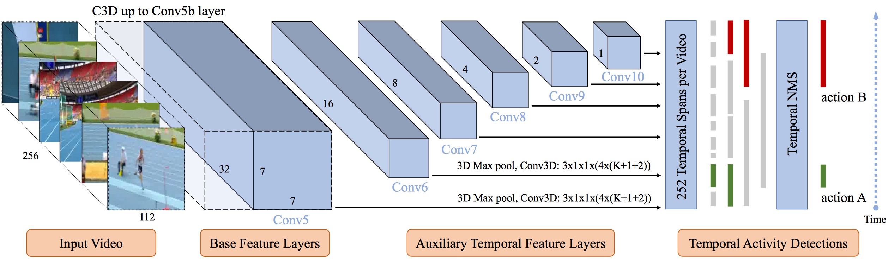

# S3D: Single Shot multi-Span Detector via Fully 3D Convolutional Network

TensorFlow implementation of the single shot activity detection model described in our [BMVC 2018](http://bmvc2018.org/) oral paper [S3D: Single Shot multi-Span Detector via Fully 3D Convolutional Network](https://arxiv.org/pdf/1807.08069v2.pdf).

In this work, we present a novel single shot multi-span detector using a simple end-to-end fully Conv3D network. The network architecture is intrinsically simple and achieves state-of-the-art performance on THUMOS'14 detection benchmark, while maintaining fast runtime speed at 1271 FPS. For more details, please check the latest version of the paper.

## Network architecture

<p align="center">
  
## Prerequisites 
- Python 2.7
- TensorFlow 1.0

## Resources
We are still working on it and will release the codes soon.

## Reference
If you find our work useful, please use the following bibtex to cite our work:
```
@inproceedings{zhang2018s3d,
  author = {Zhang, Da and Dai, Xiyang and Wang, Xin and Wang, Yuan-Fang},
  title = {S3D: Single Shot multi-Span Detector via Fully 3D Convolutional Network},
  booktitle = {Proceedings of the British Machine Vision Conference (BMVC)},
  year = {2018}
}
```
